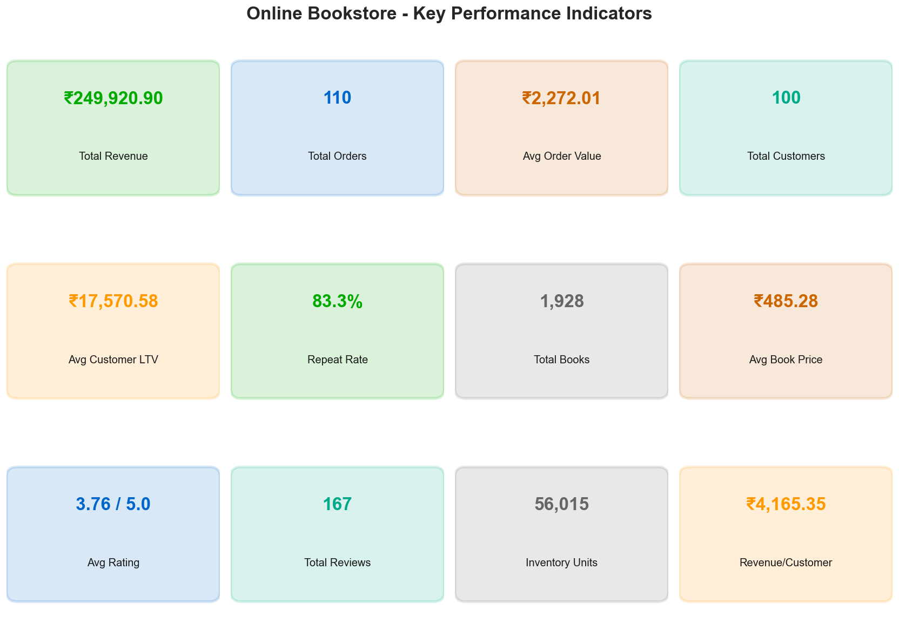
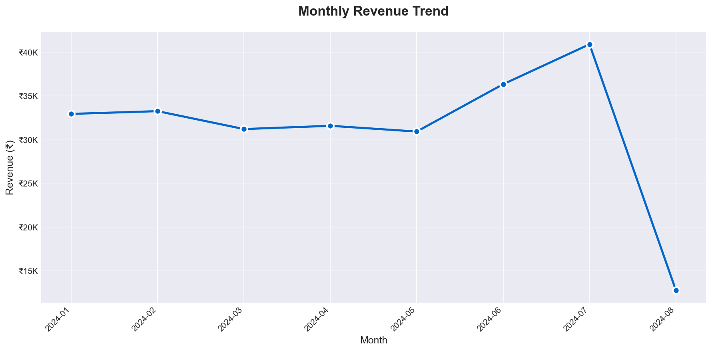
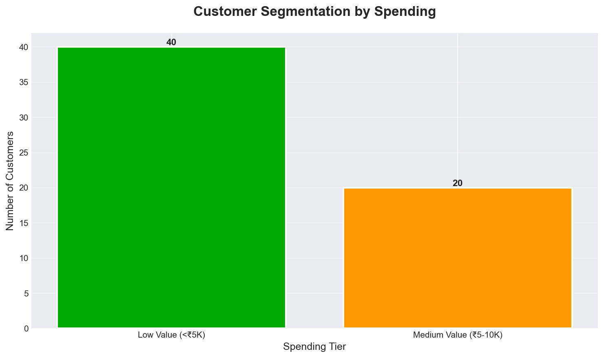

# 📚 Online Book Store — End-to-End Data Analytics Project

A complete MySQL + Python analytics project demonstrating the full data lifecycle: from normalized database design through advanced SQL to Python-powered business intelligence and actionable insights.

[](https://www.mysql.com/)
[](https://www.python.org/)
[](https://pandas.pydata.org/)

---

## 📊 Project Overview

This project implements a fully functional **online bookstore database** and performs comprehensive **data analytics** on it, following industry-standard workflows from requirement gathering through actionable business recommendations.

**Dataset:** Goodreads Books (20,000+ books)  
**Domain:** E-commerce / Online Retail  
**Data Period:** January 2024 - August 2024  

**Key Metrics:**
- 💰 ₹249,921 total revenue across 110 orders
- 📖 1,928 books from 1,793 authors across 304 categories
- 👥 100 customers (60 active buyers with 83.3% repeat rate)
- ⭐ 167 reviews, avg book rating 3.76/5.0

---

## 🎯 Project Objectives

1. **Design & implement** a normalized (3NF) relational database for an online bookstore
2. **Demonstrate** advanced SQL techniques (JOINs, subqueries, CTEs, window functions, procedures, triggers, views)
3. **Extract & clean** data using Python and pandas
4. **Calculate** domain-specific business KPIs
5. **Visualize** trends using professional, colorblind-safe charts
6. **Generate** actionable business insights following the Observation → Reason → Impact → Recommendation framework
7. **Document** the complete process in a portfolio-ready format

---

## 🛠️ Technology Stack

| Layer | Technology |
|-------|------------|
| **Database** | MySQL 8.0 |
| **Database Design** | MySQL Workbench (ER diagrams) |
| **Programming** | Python 3.13 |
| **Data Processing** | pandas, NumPy |
| **Visualization** | Matplotlib |
| **Version Control** | Git, GitHub |
| **Environment** | Anaconda |

---

## 📁 Project Structure

```
Online-Book-Store-SQL/
├── database/                          # SQL Phase
│   ├── 01_create_database.sql         # Database creation
│   ├── 02_create_tables.sql           # Schema (11 tables, 3NF normalized)
│   ├── 03_generate_sample_data.sql    # 100 customers + 110 orders
│   ├── 04_indexes.sql                 # Performance optimization indexes
│   ├── 05_views.sql                   # 6 reusable reporting views
│   ├── 06_stored_procedures.sql       # 5 procedures with business logic
│   ├── 07_triggers.sql                # 5 triggers (stock mgmt, audit logs)
│   ├── 08_business_queries.sql        # 30 analytical queries
│   └── 09_window_functions.sql        # 15 advanced analytics queries
│
├── python/                            # Python Analytics Phase
│   ├── db_connection.py               # Reusable connection module
│   ├── load_books_data.py             # ETL: CSV → MySQL (1,928 books)
│   ├── generate_transactions.py       # Generate order_items, payments, reviews, wishlists
│   └── analytics_pipeline.py          # EDA + KPI calculation + 7 charts
│
├── data/
│   ├── raw/                           # Original CSV dataset
│   └── cleaned/                       # Processed data exports
│
├── output/
│   ├── charts/                        # 7 professional visualizations
│   │   ├── 00_kpi_dashboard.png
│   │   ├── 01_monthly_revenue.png
│   │   ├── 02_top_books_revenue.png
│   │   ├── 03_category_distribution.png
│   │   ├── 04_customer_segmentation.png
│   │   ├── 05_order_status.png
│   │   └── 06_payment_methods.png
│   └── results/                       # KPI summaries
│
├── reports/
│   └── BUSINESS_INSIGHTS.md           # 7 insights + strategic recommendations
│
├── documentation/
│   ├── NORMALIZATION.md               # UNF → 1NF → 2NF → 3NF walkthrough
│   ├── SCHEMA_DOCUMENTATION.md        # Full schema reference (11 tables)
│   ├── ER_DIAGRAM.md                  # Entity-relationship diagram (Mermaid)
│   └── NORMALIZATION.md               # UNF → 3NF walkthrough
│
├── dataset/
│   └── Goodreadss Books.csv           # Source: Goodreads (20K books)
│
├── requirements.txt                   # Python dependencies
├── .gitignore
└── README.md                          # This file
```

---

## 🗄️ Database Schema (3NF Normalized)

### Core Entities

| Table | Purpose | Rows (Sample) |
|-------|---------|---------------|
| `books` | Catalog: title, ISBN, price, stock, ratings | 1,928 |
| `authors` | Distinct author names | 1,793 |
| `categories` | Book genres/categories | 304 |
| `customers` | Registered users | 100 |
| `orders` | Order headers (date, status) | 110 |
| `order_items` | Line items: book + quantity + price at purchase | 253 |
| `payments` | Payment records (method, status, amount) | 111 |
| `reviews` | Customer ratings and review text | 167 |
| `wishlists` | Books saved for later | 249 |

### Junction Tables (Many-to-Many)

- `book_authors` (3,008 links) — resolves books ↔ authors
- `book_categories` (8,700 links) — resolves books ↔ categories

### Audit Tables (Populated by Triggers)

- `stock_audit_log` (253 entries) — every stock change
- `order_status_log` — order status transitions

**[Full Schema Documentation](documentation/SCHEMA_DOCUMENTATION.md)** | **[Normalization Walkthrough](documentation/NORMALIZATION.md)**

---

## 🚀 Quick Start

### Prerequisites

- MySQL 8.0+
- Python 3.10+
- Anaconda (recommended) or pip

### Installation

```bash
# 1. Clone the repository
git clone https://github.com/yourusername/online-bookstore-analytics.git
cd online-bookstore-analytics

# 2. Install Python dependencies
pip install -r requirements.txt

# 3. Create the database and schema
mysql -u root -p < database/01_create_database.sql
mysql -u root -p online_book_store < database/02_create_tables.sql

# 4. Load books data from CSV
python python/load_books_data.py

# 5. Generate sample transactional data
mysql -u root -p online_book_store < database/03_generate_sample_data.sql
python python/generate_transactions.py

# 6. Install indexes, views, procedures, triggers
mysql -u root -p online_book_store < database/04_indexes.sql
mysql -u root -p online_book_store < database/05_views.sql
mysql -u root -p online_book_store < database/06_stored_procedures.sql
mysql -u root -p online_book_store < database/07_triggers.sql

# 7. Run analytics pipeline (generates charts + KPIs)
python python/analytics_pipeline.py
```

**Note:** Update `python/db_connection.py` with your MySQL password before running Python scripts.

---

## 📈 Key Deliverables

### SQL Phase

✅ **Database Design**
- ER Diagram (entities + relationships)
- 11 normalized tables (3NF) with PKs, FKs, constraints

✅ **Advanced SQL** (45 queries total)
- 30 business queries (JOINs, subqueries, CTEs, aggregations)
- 15 window function queries (RANK, LAG, running totals, percentiles)

✅ **Database Objects**
- 6 Views (reusable reporting abstractions)
- 5 Stored Procedures (place order, loyalty tier, sales report, refund processing)
- 5 Triggers (stock automation, rating updates, audit logging)
- 12 Indexes (query optimization)

### Python Phase

✅ **Data Engineering**
- ETL pipeline: CSV → cleaned/normalized MySQL schema
- Synthetic transaction generator (orders, payments, reviews, wishlists)

✅ **Analytics**
- 12 calculated KPIs (revenue, LTV, AOV, repeat rate, inventory value)
- 7 professional visualizations (colorblind-safe palette)
- Exploratory Data Analysis (EDA)

✅ **Business Intelligence**
- 7 structured insights (Observation → Reason → Impact → Recommendation)
- Strategic priority roadmap (next 90 days)
- KPI measurement framework

---

## 📊 Sample Insights

### Insight 1: Exceptional Customer Retention

**Observation:** 83.3% repeat customer rate (50 of 60 active buyers placed multiple orders)

**Business Impact:** While loyalty is strong, revenue is concentrated in a small cohort. 40 registered users (40%) have never purchased.

**Recommendation:** Launch first-purchase discount campaign targeting inactive registrations; formalize tiered loyalty program (Bronze/Silver/Gold/Platinum based on LTV).

---

### Insight 2: July Revenue Surge Followed by Sharp August Decline

**Observation:** July 2024 revenue peaked at ₹40,906 (+25% above ₹32K baseline), but August dropped to ₹12,766.

**Business Impact:** Revenue volatility creates cash flow unpredictability and inventory planning challenges.

**Recommendation:** Implement predictable monthly promotion calendar to smooth revenue; analyze July's top-performing categories and ensure stock availability.

---

**[Read Full Insights Report →](reports/BUSINESS_INSIGHTS.md)**

---

## 🎨 Sample Visualizations

### KPI Dashboard


### Monthly Revenue Trend


### Customer Segmentation


*All charts use a colorblind-safe, professionally validated color palette.*

---

## 📚 Learning Outcomes

This project demonstrates proficiency in:

- ✅ **Database Design** — ER modeling, normalization (UNF → 3NF), referential integrity
- ✅ **Advanced SQL** — CTEs, window functions, subqueries, stored procedures, triggers, views
- ✅ **Data Engineering** — ETL pipelines, data cleaning, validation, type handling
- ✅ **Python Data Analysis** — pandas, NumPy, Matplotlib
- ✅ **Business Intelligence** — KPI design, insight generation, strategic recommendations
- ✅ **Professional Documentation** — README, schema docs, normalization walkthroughs, code comments
- ✅ **Version Control** — Git workflow, .gitignore, commit hygiene

---

## 🔍 Business Problem Solved

**Problem:** An online bookstore needs to understand sales patterns, customer behavior, and inventory health to make data-driven decisions on promotions, stock allocation, and customer retention strategies.

**Solution:** This project built the complete data infrastructure (normalized database + ETL pipeline) and performed end-to-end analytics, delivering 7 actionable insights with concrete recommendations backed by ₹250K of transactional data.

---

## 📖 Documentation

- **[Schema Documentation](documentation/SCHEMA_DOCUMENTATION.md)** — Full table reference (11 tables)
- **[ER Diagram](documentation/ER_DIAGRAM.md)** — Entity-relationship diagram (renders on GitHub)
- **[Normalization Guide](documentation/NORMALIZATION.md)** — UNF → 3NF step-by-step
- **[Business Insights Report](reports/BUSINESS_INSIGHTS.md)** — 7 insights + strategic priorities

---

## 🤝 Contributing

This is a student portfolio project. Feedback and suggestions are welcome via Issues.

---

## 📧 Contact

**Author:** Laukik Deshmukh  
**Project Type:** End-to-End Data Analytics (SQL + Python)  
**Academic Year:** 2024  

---

## 📜 License

Dataset: Goodreads Books (public dataset)  
Code: MIT License

---

**⭐ If this project helped you understand end-to-end analytics workflows, consider starring the repo!**
