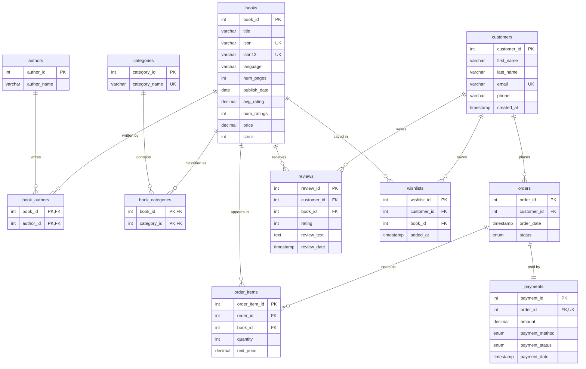

# Entity Relationship Diagram — Online Bookstore

This ER diagram renders natively on GitHub (Mermaid). It shows all 11 core tables,
their primary/foreign keys, and the cardinality of every relationship.

## Relationship Summary

| From | To | Cardinality | Via |
|------|-----|-------------|-----|
| books | authors | many-to-many | `book_authors` |
| books | categories | many-to-many | `book_categories` |
| customers | orders | one-to-many | direct FK |
| orders | order_items | one-to-many | direct FK |
| books | order_items | one-to-many | direct FK |
| orders | payments | one-to-one | direct FK (UNIQUE) |
| customers | reviews | one-to-many | direct FK |
| books | reviews | one-to-many | direct FK |
| customers | wishlists | one-to-many | direct FK |
| books | wishlists | one-to-many | direct FK |

## How to Regenerate in MySQL Workbench

For a formal image export (optional):
1. Open MySQL Workbench → **Database → Reverse Engineer** (Ctrl+R)
2. Select the `online_book_store` schema
3. Workbench auto-generates the EER diagram
4. **File → Export → Export as PNG** and save to `documentation/er_diagram.png`

> **Legend:** `||` = exactly one, `o{` = zero-or-many. PK = primary key,
> FK = foreign key, UK = unique key.
